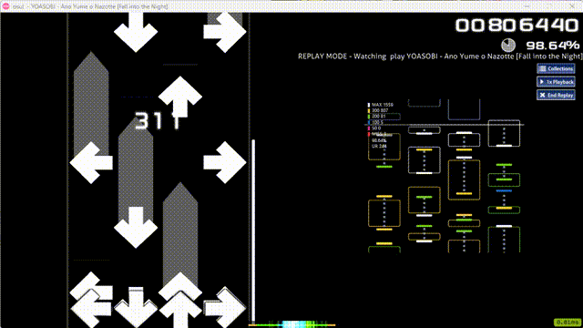

# Mania Replay Master（tosu 插件）

将 [Mania-Replay-Master](https://github.com/Mania-Visualization-Project/Mania-Replay-Master) 的判定可视化思路带进 [tosu](https://github.com/tosuapp/tosu) 实时覆盖层：
游玩与观看回放时实时绘制下落音符、判定颜色与按键动作偏移，用于复盘「实际操作 vs 谱面判定」的差距。

> A real-time mania replay & judgement overlay for tosu, inspired by Mania-Replay-Master.

> **本目录是代码审查后的修复版本（v0.5.2，基于上游 0.5.0）**：修复清单见 [FIXES.md](FIXES.md)，更新说明见 [中文](CHANGELOG.zh.md) / [English](CHANGELOG.en.md)。



## 1. 插件简介

这是一个 由Deepseek撰写的 tosu 静态插件，面向 osu!mania：

- 在**游玩**与**观看回放**时实时渲染下落音符，按真实判定着色；
- 绘制按键的**按下 / 抬起位置**与长按虚线，直观对比早按 / 晚按的偏差；
- 判定窗口与游戏一致：支持 **osu!stable（ScoreV1 / ScoreV2）** 与 **osu!lazer（原版 / Classic mod）**，包含 HR / EZ / DT / HT / DA 等 mod 与 OD 的影响；
- 进入选歌、菜单等界面时自动隐藏，不打扰正常游戏。

## 2. 主要特性

- **四种判定体系对齐**：stable V1、stable ScoreV2、lazer 原版、lazer Classic；窗口按 OD 与 mods 精确计算（含转换谱的低 OD 特例）。
- **判定着色**
  - V1 / Classic：整根长条使用「头 + 尾」合成判定（与 `judgeRelease` 规则一致）；
  - ScoreV2：长条始终为单个中性矩形、不随判定变色，头 / 尾判定由各自的按键动作标记体现。
- **按键动作层**：按下 / 抬起以实心标记绘制在实际判定的位置；长按虚线从按下开始随时间生长，抬起后补全整段，偏移对比不会突然跳出。
- **变速支持**：0.5x – 2x 回放可用（时间外推、顺序对齐、MISS 跳段对齐）。
- **可调外观**：判定线位置与粗细、下落速度、线后审查时间、统计面板缩放、颜色、透明度、渲染缩放、帧率上限等。

## 3. 使用方法

### 前置要求

- [tosu](https://github.com/tosuapp/tosu)（推荐 4.26+）；
- osu!stable 或 osu!lazer，且当前谱面为 mania；
- 游玩或观看回放。

### 安装

将本仓库放到 tosu 的 `static` 目录下，推荐目录名 `Mania Replay Master`（本副本目录名为 `Mania Replay Master (fixed)`，tosu 列表里显示的仍是 metadata.txt 中的 `Mania Replay Master`）：

```bash
# 方式一：git clone（可直接克隆进 static 目录）
git clone https://github.com/M1ch1bata/tosu-mania-replay-master.git "tosu/static/Mania Replay Master"

# 方式二：下载 ZIP 解压后，将文件夹重命名为 Mania Replay Master 放入 tosu/static/
```

重启 tosu 后，在 tosu 控制台的计数器 / 覆盖层列表中即可看到 **Mania Replay Master**。

### 添加为覆盖层

- **OBS**：添加「浏览器源」，URL 填
  `http://127.0.0.1:24050/Mania%20Replay%20Master/index.html`
  （也可省略 URL 后缀，直接在 tosu 页面复制该插件的地址）；
- **游戏内覆盖层**：在 tosu 设置中开启 `enableIngameOverlay`，并把本插件加入显示列表。

插件只在 `play` 状态渲染，选歌 / 菜单自动隐藏。

### 设置项

| 设置 | 说明 | 默认 |
| --- | --- | --- |
| Colour: MAX / 300 / 200 / 100 / 50 / MISS | 各判定颜色 | 见 settings.json |
| Colour: Unjudged | 未判定音符颜色 | `#8fa3c8` |
| Colour: Long Note Body | 长条固定颜色（V2）与长按虚线颜色 | `#9aa7bd` |
| Note Height | 音符高度（480 宽的判定区坐标） | `22` |
| Note Border Width | 音符描边宽度 | `2` |
| Action Height | 按键动作块 / 虚线大小 | `7` |
| Hit Position (60 - 470) | 判定线位置；越小则线上预览带越短、线后复盘区越大 | `80` |
| Judgement Line Width | 判定线粗细 | `4` |
| Judgement Review Time (ms) | 判定线后至少保留的可见时间；过高滚动速度会自动放慢 | `1500` |
| Stats Panel Scale | 左上统计面板缩放 | `1.4` |
| Mania Scroll Speed Override | 覆盖游戏滚动速度（0 = 跟随游戏） | `0` |
| Show Actions / Stats / Hit Line | 是否绘制动作层 / 统计面板 / 判定线 | 开 |
| Playfield Opacity | 整体不透明度 | `1` |
| Background Color / Opacity | 背景色与不透明度（0 = 全透明） | `#000000` / `0` |
| Render Scale (%) | 判定区在窗口内的缩放 | `100` |
| FPS Limit | 重绘帧率上限（0 = 不限） | `0` |
| Exact Mode Helper URL | 精确模式 helper 地址（仅接受回环地址；留空禁用精确模式） | `http://127.0.0.1:24051` |
| Exact Mode Helper Token | 可选共享令牌，需与 helper 的 `--token` 一致 | 空 |
| Analysis Mode | 分析模式：`Auto` 自动、`Live` 只做实时判定、`Replay` 只做回放预渲染 | `Auto` |
| Exact Replay (helper) | 观看回放时套用 `.osr` 逐列按键时间轴 | 开 |
| Exact Live (key hook) | 游玩时由 helper 键盘钩子推送逐列按键 | 开 |

### 常见问题

- **第一次观看回放为什么是「边播边判」？**
  回放播放前无法预知尚未发生的按键判定；第一次观看会按实时数据累积。看完一遍后插件会缓存整局判定，之后再次观看、循环或拖动进度都会立即完整呈现。
- **换图 / 换 mods 会串缓存吗？**
  缓存按「谱面 checksum + 客户端 + mods + 键数 + 判定系统」隔离；不匹配时会自动回退到实时判定。
- **支持 变速 回放吗？**
  支持。插件会估计播放倍速并对齐时间，高倍速下使用顺序匹配 + MISS 跳段避免错位。
- **统计面板显示 0 或与游戏不一致？**
  面板优先使用 tosu 提供的游戏计数；当 tosu 读取不到（部分 stable 版本会出现 `play.hits` 全 0）时，会自动回退为按插件匹配的判定计算，回放复盘（完整时间轴）下直接显示最终统计。UR 始终由插件按判定误差计算。
- **游戏里看不到插件？**
  确认目录名正确（如 `Mania Replay Master` 或 `Mania Replay Master (fixed)`），且放在 tosu 的 `static` 目录下，然后重启 tosu。
- **观察回放时没有走精确模式？**
  精确回放只在 tosu 报告 `replayUIVisible` 为真（即正在观看回放）时启用；实时游玩不会再套用上一次的 `.osr` 时间轴。若 helper 刚刚启动导致首次拉取失败，插件会在 5 秒后自动重试。
- **重新播放回放时统计面板为什么从零开始？**
  这是 0.5.2 起的预期行为：统计面板与 UR 按当前回放时间轴计算，倒带或重新播放会归零并随进度增长；谱面音符颜色仍沿用缓存时间轴，方便直接复盘整局。
- **DT / HT 下判定颜色不对？**
  osu!mania 在 stable 与 lazer 中都会对判定窗口做 rate 补偿（真实时间窗口长度不变），插件已统一按 `窗口 × rate` 计算；若仍不一致，请附上客户端、mods 与 UR 数据反馈。
- **同一排和弦 / 连打的判定颜色仍然串位？**
  和弦必须靠逐列数据才能正确归属。插件把两条链完全拆开：**边玩边分析**只使用 keyboard hook 的逐列按下/抬起事件，按下时判定 note 头、抬起时判定长条尾（`applyLiveKey` + `lockPoint` + `hookSongTime`），绝不读取 `.osr`；**一边播放录像一边分析**只读取 `.osr` 并一次性预渲染整局，不使用键盘钩子。若自动切换不符合当前场景，请把 `Analysis Mode` 手动设为 `Live` 或 `Replay`。
- **不想常驻 helper，能做到和弦按列归属吗？**
  可以先试无 helper 模式：插件会消费 tosu precise 的 `keys`（`isPressed`/`count`）作为列提示，并用「未暴露列排除法」处理 tosu 没有送出的列。首次收到有效提示时控制台会打印 `tosu precise keys: column hints active (N slots)`，也可用 `window.__maniaReplayMaster.state.keyHintSeen` 检查。
  注意：老版 tosu 只送 4 个槽（stable 侧只填 3 个），4K 还能靠排除法补第 4 列，**5K–10K 必须让 tosu 暴露完整列数组**——补丁与说明见 `tools/tosu-mania-keys-patch.md`（stable 需要改内存读取器 + API，lazer 的内部数组已是 N 列、只差 API 透出）。补丁生效后插件自动按列判定，无需 helper。
- **怎么确认 helper 在工作？**
  运行时状态栏会显示 `exact: live (A S ; ')`（括号里是 helper 解析出的键位）。如果显示 `exact: helper offline (run tools/mrm-helper.mjs)`，说明 helper 没启动：双击 `tools\start-helper.bat`，或运行 `node "tools/mrm-helper.mjs"`（osu 目录会自动探测，无需填写）。
- **为什么 Auto 模式下偶尔像在「回放上一局」？**
  `Auto` 依赖 tosu 的 `replayUIVisible`（普通游玩时是陈旧值）和实时输入来判断模式。如果确定只会实时游玩，建议直接固定为 `Live`；只用于复盘录像则固定为 `Replay`，两条管线不会被彼此污染。
- **精确模式提示 helper 不可用？**
  helper 只接受来自回环地址的浏览器请求；若设置了 `--token`，还需在插件设置里填入相同的 `Exact Mode Helper Token`。离开游戏后 helper 会在 10 秒内自动结束键盘钩子进程。

## 4. 贡献指南

欢迎提交 Issue 与 PR。

### 报告问题

请附上：

- tosu 版本、客户端（stable / lazer）与判定模式（V1 / V2 / Classic）；
- 复现步骤（地图、mods、回放倍速、是否首次观看）；
- 现象截图或录屏；如有需要可附 `tosu/logs/latest.log` 片段。

### 提交 PR

1. Fork 本仓库并新建分支（如 `fix/ln-coloring`）；
2. 修改后运行测试，确保全绿：

   ```bash
   node test/mrm-test.mjs   # 当前 92 项断言，无需安装依赖
   ```

3. 提交 PR，说明变更动机与验证方式。

### 开发说明

- 纯前端、无构建步骤：`main.js` + `index.html` + `main.css` + `settings.json` + `metadata.txt`；
- 浏览器调试接口：`window.__maniaReplayMaster`（暴露 state / 判定匹配 / 渲染等函数）；
- 测试基于 Node 内置 `vm` 模拟 DOM，可在无 tosu 环境下验证判定窗口、匹配、缓存与渲染逻辑；
- 代码风格：2 空格缩进、保持现有模块内聚，避免引入全局变量与构建依赖。

## 精确模式（本地辅助进程）

插件本体无法读取磁盘回放或获取游戏按键，因此提供一个可选的本地辅助进程 `tools/mrm-helper.mjs`（纯 Node，单文件，无需安装依赖，内含 LZMA 解码器）：

```bash
# osu! 目录自动探测（TOSU_OSU_PATH → tosu.env → 运行中的 osu! 进程 → 注册表 → 系统默认位置）
node "tools/mrm-helper.mjs" --port 24051

# 需要覆盖时才传 --osu：
node "tools/mrm-helper.mjs" --osu "E:\osu!"

# 建议加上令牌（随后在插件设置里填写同一个 Exact Mode Helper Token）：
node "tools/mrm-helper.mjs" --token my-secret
```

helper 只监听 `127.0.0.1`，并且只接受来自回环地址的浏览器跨域请求；设置 `--token` 后所有请求都必须携带令牌，避免本机其他网页调用 `/live` 订阅按键流。最后一个 SSE 客户端断开 10 秒后，键盘钩子进程会自动退出。

#### 启动 / 停止 helper（双击即可）

- 双击 `tools\start-helper.bat`：helper 隐藏到后台运行；它会监视 `osu!` 与 `tosu`，两者都出现过之后，任一关闭就自动退出（另有 10 分钟无请求兜底退出）。
- 双击 `tools\stop-helper.bat`：立即关闭 helper。
- **不需要填 osu! 目录**：helper 会自动探测；要覆盖时才传参 `start-helper.bat "E:\osu!"`；端口 / 令牌等参数可在 `tools\start-helper.vbs` 里改。
- 探测失败（例如 helper 比 osu! 先启动）也没关系：helper 会在需要读取回放/键位时重试，osu! 出现后即可自动接上。
- 不需要登录自启、计划任务或常驻 watcher：helper 只在你双击后存在，并会自己收尾。
- 插件页面打开期间会每 25 秒发一次轻量 `/status` 心跳，用于刷新「10 分钟无请求」的兜底计时。

工作方式（两条独立管线）：

- **实时游玩（Live）**：helper 启动 `tools/key-hook.ps1`（Windows 低级键盘钩子，4K–8K 使用 stable 键位配置），把逐列按下/抬起事件经 SSE 推送给插件；插件使用钩子自带的事件时间戳（锚定到游戏时钟：v2 的 `beatmap.time.live`，若 tosu 提供 `precise.currentTime` 也会用于 10ms 级校正）按 osu! 客户端的音符锁规则实时判定（`applyLiveKey` + `lockPoint` + `hookSongTime`），只使用真实输入，不读取 `.osr`。
- **观看回放（Replay）**：helper 按当前谱面 MD5 从 `Data\r` 找到对应 `.osr`，解出**逐帧按键位掩码**（精确列归属），插件自动对齐时间轴并把整局判定一次性预渲染（`applyExactTimeline`），不连接键盘钩子。

插件设置中可配置 `helperUrl`（默认 `http://127.0.0.1:24051`）、`helperToken`、`analysisMode`、`exactReplay`、`exactLive`；helper 未运行时插件自动回退到原有 hitError 推断模式。`Analysis Mode` 可选 `Auto`（自动切换）、`Live`（只做实时判定）、`Replay`（只做回放预渲染）；固定场景建议手动指定，避免两条管线互相干扰。

测试：

```bash
node test/mrm-test.mjs         # 92 项断言（无需 tosu / helper）
node test/mrm-exact-test.mjs   # 端到端精确模式（需要 helper 与 Data\r，缺少映射索引时自动跳过）
node test/mrm-live-check.mjs   # 实时按键通道自检（交互式，按提示按键）
node test/mrm-live-monitor.mjs # 实机监控并生成诊断日志（需要 helper 与 tosu）
```

## 致谢

- [Mania-Visualization-Project/Mania-Replay-Master](https://github.com/Mania-Visualization-Project/Mania-Replay-Master)：判定合成（`judgeRelease`）与可视化思路的参考；
- [tosu](https://github.com/tosuapp/tosu)：提供实时数据与插件平台；
- osu! 社区与所有测试反馈者。

## 许可

[MIT](LICENSE)
