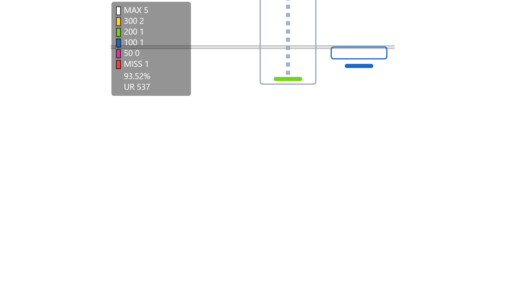
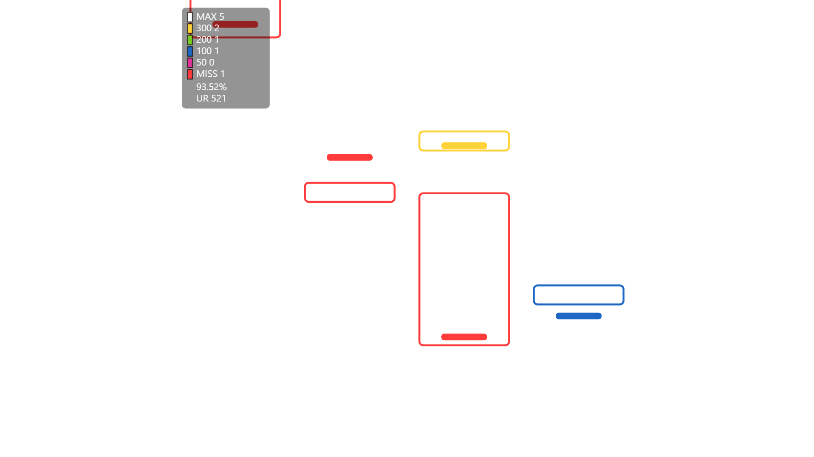

# Mania Replay Master（tosu 插件）

将 [Mania-Replay-Master](https://github.com/Mania-Visualization-Project/Mania-Replay-Master) 的判定可视化思路带进 [tosu](https://github.com/tosuapp/tosu) 实时覆盖层：
游玩与观看回放时实时绘制下落音符、判定颜色与按键动作偏移，用于复盘「实际操作 vs 谱面判定」的差距。

> A real-time mania replay & judgement overlay for tosu, inspired by Mania-Replay-Master.




## 1. 插件简介

这是一个 tosu 静态插件，面向 osu!mania：

- 在**游玩**与**观看回放**时实时渲染下落音符，按真实判定着色；
- 绘制按键的**按下 / 抬起位置**与长按虚线，直观对比早按 / 晚按的偏差；
- 判定窗口与游戏一致：支持 **osu!stable（ScoreV1 / ScoreV2）** 与 **osu!lazer（原版 / Classic mod）**，包含 HR / EZ / DT / HT / DA 等 mod 与 OD 的影响；
- 进入选歌、菜单等界面时自动隐藏，不打扰正常游戏。

## 2. 主要特性

- **四种判定体系对齐**：stable V1、stable ScoreV2、lazer 原版、lazer Classic；窗口按 OD 与 mods 精确计算（含转换谱的低 OD 特例）。
- **判定着色**
  - V1 / Classic：整根长条使用「头 + 尾」合成判定（与 `judgeRelease` 规则一致）；
  - ScoreV2：长条始终为单个中性矩形、不随判定变色，头 / 尾判定由各自的按键动作标记体现。
- **按键动作层**：按下 / 抬起以实心标记绘制在实际判定的位置；长按虚线从按下开始随时间生长，抬起后补全整段，偏移对比不会突然跳出。
- **完整判定时间轴（复盘模式）**：插件会按「谱面 + mods + 判定系统」缓存整局判定。再次观看同一回放、循环播放或拖动进度时，会立即呈现整条时间轴的判定颜色与动作，而不是边播边判。
- **实时容错**：命中误差永远不会被误判成 MISS；MISS 数量受游戏真实计数约束；观看他人回放时若缓存不匹配会自动回退到实时判定。
- **高倍速支持**：0.5x – 5x 回放可用（时间外推、顺序对齐、MISS 跳段对齐）。
- **可调外观**：判定线位置与粗细、下落速度、线后审查时间（保证 ≥1500ms）、统计面板缩放、颜色、透明度、渲染缩放、帧率上限等。

## 3. 使用方法

### 前置要求

- [tosu](https://github.com/tosuapp/tosu)（推荐 4.26+）；
- osu!stable 或 osu!lazer，且当前谱面为 mania；
- 游玩或观看回放。

### 安装

将本仓库放到 tosu 的 `static` 目录下，目录名保持 `Mania Replay Master`：

```bash
# 方式一：git clone（可直接克隆进 static 目录）
git clone https://github.com/M1ch1bata/tosu-mania-replay-master.git "tosu/static/Mania Replay Master"

# 方式二：下载 ZIP 解压后，将文件夹重命名为 Mania Replay Master 放入 tosu/static/
```

重启 tosu 后，在 tosu 控制台的计数器 / 覆盖层列表中即可看到 **Mania Replay Master**。

### 添加为覆盖层

- **OBS**：添加「浏览器源」，URL 填
  `http://127.0.0.1:24050/Mania%20Replay%20Master/index.html`
  （也可省略 URL 后缀，直接在 tosu 页面复制该插件的地址）；
- **游戏内覆盖层**：在 tosu 设置中开启 `enableIngameOverlay`，并把本插件加入显示列表。

插件只在 `play` 状态渲染，选歌 / 菜单自动隐藏。

### 设置项

| 设置 | 说明 | 默认 |
| --- | --- | --- |
| Colour: MAX / 300 / 200 / 100 / 50 / MISS | 各判定颜色 | 见 settings.json |
| Colour: Unjudged | 未判定音符颜色 | `#8fa3c8` |
| Colour: Long Note Body | 长条固定颜色（V2）与长按虚线颜色 | `#9aa7bd` |
| Note Height | 音符高度（480 宽的判定区坐标） | `22` |
| Note Border Width | 音符描边宽度 | `2` |
| Action Height | 按键动作块 / 虚线大小 | `7` |
| Hit Position (60 - 470) | 判定线位置；越小则线上预览带越短、线后复盘区越大 | `80` |
| Judgement Line Width | 判定线粗细 | `4` |
| Judgement Review Time (ms) | 判定线后至少保留的可见时间；过高滚动速度会自动放慢 | `1500` |
| Stats Panel Scale | 左上统计面板缩放 | `1.4` |
| Mania Scroll Speed Override | 覆盖游戏滚动速度（0 = 跟随游戏） | `0` |
| Show Actions / Stats / Hit Line | 是否绘制动作层 / 统计面板 / 判定线 | 开 |
| Playfield Opacity | 整体不透明度 | `1` |
| Background Color / Opacity | 背景色与不透明度（0 = 全透明） | `#000000` / `0` |
| Render Scale (%) | 判定区在窗口内的缩放 | `100` |
| FPS Limit | 重绘帧率上限（0 = 不限） | `0` |

### 常见问题

- **第一次观看回放为什么是「边播边判」？**
  回放播放前无法预知尚未发生的按键判定；第一次观看会按实时数据累积。看完一遍后插件会缓存整局判定，之后再次观看、循环或拖动进度都会立即完整呈现。
- **换图 / 换 mods 会串缓存吗？**
  缓存按「谱面 checksum + 客户端 + mods + 键数 + 判定系统」隔离；不匹配时会自动回退到实时判定。
- **支持 5x 回放吗？**
  支持。插件会估计播放倍速并对齐时间，高倍速下使用顺序匹配 + MISS 跳段避免错位。
- **游戏里看不到插件？**
  确认目录名是 `Mania Replay Master`，且放在 tosu 的 `static` 目录下，然后重启 tosu。

## 4. 贡献指南

欢迎提交 Issue 与 PR。

### 报告问题

请附上：

- tosu 版本、客户端（stable / lazer）与判定模式（V1 / V2 / Classic）；
- 复现步骤（地图、mods、回放倍速、是否首次观看）；
- 现象截图或录屏；如有需要可附 `tosu/logs/latest.log` 片段。

### 提交 PR

1. Fork 本仓库并新建分支（如 `fix/ln-coloring`）；
2. 修改后运行测试，确保全绿：

   ```bash
   node test/mrm-test.mjs   # 当前 54 项断言，无需安装依赖
   ```

3. 提交 PR，说明变更动机与验证方式。

### 开发说明

- 纯前端、无构建步骤：`main.js` + `index.html` + `main.css` + `settings.json` + `metadata.txt`；
- 浏览器调试接口：`window.__maniaReplayMaster`（暴露 state / 判定匹配 / 渲染等函数）；
- 测试基于 Node 内置 `vm` 模拟 DOM，可在无 tosu 环境下验证判定窗口、匹配、缓存与渲染逻辑；
- 代码风格：2 空格缩进、保持现有模块内聚，避免引入全局变量与构建依赖。

## 致谢

- [Mania-Visualization-Project/Mania-Replay-Master](https://github.com/Mania-Visualization-Project/Mania-Replay-Master)：判定合成（`judgeRelease`）与可视化思路的参考；
- [tosu](https://github.com/tosuapp/tosu)：提供实时数据与插件平台；
- osu! 社区与所有测试反馈者。

## 许可

[MIT](LICENSE)
